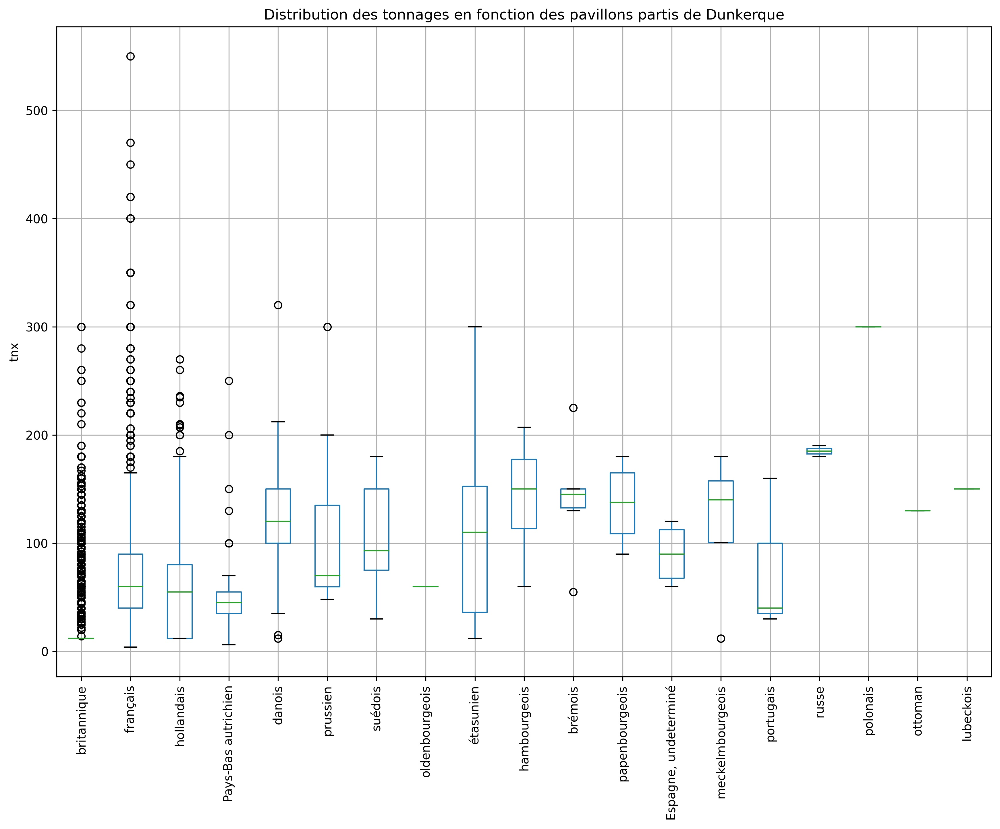

# portic
Certains codes d'analyse non archivés sur humanum, divers et variés, réalisés dans le programme ANR PORTIC

Data come most of the time of the database (postgres), but someone can get data (the last version) from the API : http://data.portic.fr/ like CSV files. 

## Smogglage.ipynb 

Allows for the analysis of departures from Dunkirk.

Produces 

## Carto_module12.ipynb and carto_module12_suite.ipynb 

This is for the analysis of product / tonnage sent per destination from Dunkirk.

Produces this kind of sankey diagram

